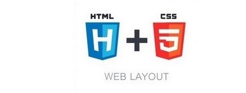
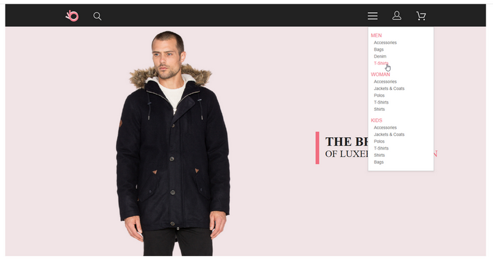
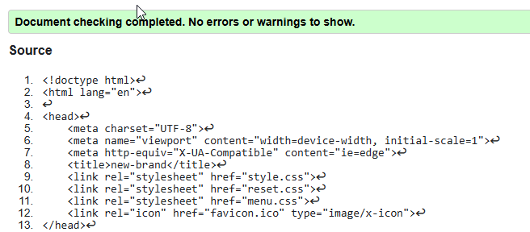

# Веб-вёрстка HTML/CSS (семинары)
## Проверка сайта на ошибки и вспомогательные инструменты

<br><br>
<hr>

### Домашнее задание

Макет https://www.figma.com/file/mnLY69cYE5cqWM5w6n5hXx/Seo-%26-Digital-Marketing-Landing-Page?node-id=190%3A1194

- Доделать, если что-то не получилось реализовать на прошлом [уроке](#действие-9).
- Проверить сайт на ошибки.
- Разместить сайт в сети интернет.<br><br>
  <br>

**Ссылка** на сайт в [интернете](https://new-brand.upperlinks.ru/) https://new-brand.upperlinks.ru/
<hr>

- **Данная промежуточная аттестация оценивается по системе "зачет" / "не зачет"**.
- **Критерии оценивания**:
  - "Зачет" выставляется при выполнении слушателем всех критериев: сайт запускается и работает
  - "Незачет" выставляется, если сайт не запускается или выдает ошибки при работе

<br><br>
<hr>

### Макет

<br><br>
<hr>

### Решение задания

#### Действие 1

1. Установка редактора кода: <br>
  - Если вы ещё не сделали этого на семинаре, скачайте и установите редактор кода
2. Создание структуры проекта:
  - Создайте новую пустую папку для проекта и дайте ей название по вашему выбору, например, `gb-website`.
3. Создание главной страницы:
  - Внутри папки проекта создайте файл `index.html`.
  - В этом файле создайте структуру HTML-документа с базовыми элементами:
    - Добавьте меню сайта, которое должно быть одинаковым на всех страницах, состоящее из ссылок на главную страницу `index.html`, каталог `catalog.html` и контакты `contacts.html`.
    - Добавьте заголовок `h1` с текстом "Главная страница".
    - Используйте расширение Emmet в VS Code для создания параграфа p с произвольным текстом (например, используя lorem).
    - Добавьте подзаголовок `h2` с текстом "Добро пожаловать на сайт".
    - Создайте три параграфа `p` с произвольным текстом.
4. Создание страницы каталога:
  - Рядом с файлом `index.html` создайте папку `catalog`.
  - Внутри папки catalog создайте файл `catalog.html`.
  - В этом файле создайте структуру HTML-документа с базовыми элементами:
    - Добавьте меню сайта (такое же, как на главной странице).
    - Добавьте заголовок `h1` с текстом "Каталог".
    - Создайте параграф p с произвольным текстом из 150 слов (используйте lorem150 в Emmet).
    - Добавьте три карточки с товарами. Каждая карточка должна содержать:
    - Изображение товара.
    - Название товара.
    - Описание товара.
5. Создание папки для изображений:
  - Создайте папку img в корневом каталоге проекта.
  - Разместите в этой папке изображения товаров. Вы можете выбрать любые изображения по вашей тематике, например, с [Freepik](https://www.freepik.com/search?format=search&orientation=portrait&query=products).
6. Настройка переходов между страницами:
  - Убедитесь, что меню на главной странице и странице каталога содержит ссылки для перехода между страницами.

<br><br>
<hr>


#### Действие 2

1. Создание файла стилей:
    - В корневой папке вашего проекта создайте новый файл стилей с именем `style.css`.
2. Подключение стилей ко всем страницам:
    - Подключите файл style.css ко всем HTML-страницам вашего проекта (например, `index.html` и `catalog.html`). Для этого добавьте ссылку на CSS-файл в разделе
      `<head>` каждого HTML-документа.
3. Задание стиля для ссылок:
    - В файле style.css добавьте правило для всех ссылок (`<a>`) на странице:
    - Копировать код css
      `a {
      text-decoration: none;
      }`
4. Проверка работы стилей:
    - Проверьте, что стиль для ссылок применён ко всем страницам проекта и что текст ссылок больше не подчеркнут.
5. Стили для body
    - Для тега body задайте следующие стили
      `body {
      font-family: Arial, sans-serif;
      margin: 0;
      }`
6. Задание стиля для ссылок меню:
    - На всех страницах добавьте класс к элементам меню (придумайте логичное название класса, например, `menu-link`).
    - В файле `style.css` добавьте правила для данного класса:
        ```
        color: cornflowerblue;
        font-size: 16px;
        line-height: 20px;
      ```
7. Проверка стилей меню:
    - Убедитесь, что стиль для ссылок меню применён ко всем страницам проекта.
8. Стилизация заголовков h1:
    - В файле `style.css` создайте класс для заголовков h1 (например, `main-heading`) и задайте следующие стили:
        ```
        color: #222222;
        font-size: 28px;
        line-height: 36px;
        font-weight: 700;
       ```
9. Применение стиля к заголовкам h1:
    - Примените созданный класс ко всем заголовкам h1 на всех страницах.
10. Стилизация параграфов:
    - В файле `style.css` создайте класс для параграфов (например, `paragraph-text`) и задайте следующие стили:
        ```
        font-weight: 300;
        font-size: 18px;
        line-height: 30px;
        color: #7D7987;
        ```
11. Применение стиля к параграфам:
    - Примените созданный класс ко всем параграфам на страницах проекта, кроме карточек товара.
12. Стилизация заголовков h2:
    - В файле `style.css` создайте класс для заголовков `h2` (например, `section-heading`) и задайте следующие стили:
        ```
        color: coral;
        font-weight: 700;
        font-size: 36px;
        line-height: 80px;
        ```
13. Применение стиля к заголовкам h2:
    - Примените созданный класс ко всем заголовкам `h2` на страницах проекта.

<br><br>
<hr>


#### Действие 3

- Скачайте файл макета hw_maket.fig
- Импортируйте макет в figma и откройте страницу Home Page

**Создание HTML-страницы по макету**

1. Скачать и импортировать файл в Figma:
    - Скачайте файл макета и импортируйте его в Figma.
2. Разбить макет на блоки в Figma:
    - Используя Figma, разбейте видимую часть макета на логические блоки, как это показано на семинаре. Это поможет вам лучше организовать контент в HTML.
3. Создать структуру проекта:
    - Создайте новую папку для вашего проекта. Назовите её, например, `my-website`.
    - Внутри папки создайте файл `index.html`.
4. Работа с HTML:
    - Откройте файл `index.html` и добавьте следующие элементы:
        - Вставьте все блоки, которые вы выделили в Figma.
        - Добавьте HTML-контент внутри этих блоков:
            - заголовки (`<h1>`), параграфы (`<p>`), кнопки (`<button>`), изображения (``).
        - Позиционирование элементов не требуется на этом этапе.
5. Создание стилей:
    - В той же папке или в папке css создайте файл стилей `style.css`.
    - Подключите этот файл стилей к вашему index.html. Для этого добавьте следующую строку в `<head>` вашего HTML-документа: <br>
      `<link rel="stylesheet" href="style.css">`
    - В файле style.css добавьте базовые стили:
        - Обнулите стандартные отступы и поля с помощью сброса отступов как на семинаре или используйте готовые сбросы `normalize.css` или `reset.css`
        - Добавьте необходимые отступы для блоков, используя свойства `margin` и `padding`.
6. Дополнительные инструкции:
    - Обязательно посмотрите запись семинара перед выполнением задания, чтобы убедиться, что вы следуете всем необходимым шагам.


<br><br>
<hr>


#### Действие 4

I. Анализ макета
- Откройте макет в Figma и обратите внимание на следующие ключевые элементы:
    - Цветовая палитра: Цвета фона, текста, кнопок и ссылок.
    - Шрифты и размеры: Шрифты, размеры шрифтов и их стили.
    - Расположение элементов: Положение элементов на странице, отступы и выравнивание.
    - Размеры и отступы: Ширина и высота блоков, внутренние и внешние отступы (`padding` и `margin`).

II. Применение стилей
1. Фон и отступы
    - Убедитесь, что фон соответствует макету.
    - Проверьте отступы (`padding`).
2. Навигация
    - Логотип: Проверьте размер логотипа.
    - Ссылки меню: Настройте цвет, размер шрифта, отступы и стили ссылок в меню. Используйте `display: flex;` для расположения ссылок.
3. Контент
    - Позиционирование: Для позиционирования контента и изображения используйте обертку со свойством `display: flex;`.
    - Ширина: Задайте ширину контентной части по макету используя `max-width`
4. Проверка и корректировка
    - Сравните свою версию с макетом в Figma, чтобы убедиться, что все элементы правильно стилизованы и расположены.

<br><br>
<hr>


#### Действие 5

- Продолжайте работу с тем же макетом
- Выберите страницу Features & Services
- Стилизация и позиционирование элементов
    1. Добавить весь контент из макета, секции features и services
    2. Ко всем элементам контента добавить классы.
    3. Добавить стили для всего контента сайта.
    4. Расставить элементы в соответствии с макетом, используйте flex
  
<br><br>
<hr>

#### Действие 6

- С этого задания мы начнем работу над новым проектом Brand
- Скачайте макет из урока `brand.fig`
- Выберите страницу "Brand - 1"

Мы уже отлично умеем работать с макетом, в этом и есть основная задача верстальщика.

1. Создать новую папку, например, `new-brand`, в ней сделать заготовку:
    - `index.html`
    - папка css с файлом `style.css`
    - папка `img`
2. Полностью реализовать вёрстку проекта - страница "Brand - 1":
    - Добавить весь контент из макета.
    - Ко всем элементам контента добавить классы.
    - Добавить стили для всего контента сайта.
    - Расставить элементы в соответствии с макетом.
    - Адаптив создавать не нужно.

<br><br>
<hr>

#### Действие 7

- Продолжаем работу над проектом Brand
- Выберите страницу "Brand - 2"

В данном уроке мы переходим к созданию планшетной версии проекта - страница "Brand - 2".
1. Создать один, максимум два медиа запроса, чтобы наш проект отлично смотрелся на разрешениях экрана 768-1024:
    ```
        /* Медиазапрос для ширины экрана от 768px до 1024px */
        @media only screen and (min-width: 768px) and (max-width: 1024px) {
           /* Стили css для указанного диапазона ширины экрана */
        }
    ```
2. Создать планшетную версию проекта.
3. Мобильную версию сайта создавать не нужно.

<br><br>
<hr>

#### Действие 8

- Продолжаем работу над проектом Brand
- Выберите в макете страницу "Brand - 3"

В данном уроке мы переходим к созданию мобильной версии проекта - страница "Brand - 3"

1. Создать один, максимум два медиа запроса, чтобы наш проект отлично смотрелся на разрешениях экрана 320-767:
    ```
        /* Медиазапрос для ширины экрана от 320px до 767px */
        @media only screen and (min-width: 320px) and (max-width: 767px) {
           /* Стили css для указанного диапазона ширины экрана */
        }
    ```
2. Создать мобильную версию проекта

<br><br>
<hr>

#### Действие 9

- В данном уроке нам необходимо доделать 2 секции и `footer`, главной страницы интернет-магазина.
- Продолжаем работу над проектом Brand
- Выберите в макете страницу "Brand - 4":
    - Добавляем весь оставшийся контент секции `feature` и `subscribe`, а так же `footer`
    - Адаптировать под планшетную и мобильную версию
    - Создаем мобильную версию проекта.
    - Добавьте эффекты наведения, используя страницу макета "Brand - hover"


<br><br>
<hr>

#### Действие 10

- Проверить сайт на ошибки:
    - Логотип должен быть ссылкой на главную страницу. Эта правда является одной
    из самых частых, так как об этом нигде не пишут, но постоянно требуют
    реализовать такой функционал.
    - Добавление текста изображением, если мы видим текст в макете, то его
      необходимо добавлять именно текстом, не стоит скачивать его как
      изображение, тем более делать скриншот.
    - Стандартные эффекты наведения или фокуса в макете, тут проще всего
      вспомнить поле ввода с синей рамкой, стандартной. Вам нужно исключать такие
      стандартные эффекты в вашем проекте.
    - Проверить, как выглядит сайт на большем или меньшем разрешении экрана.
    - Проверить большого количества текста, ваш сайт не должен рушиться из-за
      того, что в вашем проекте станет в 2 или 3 раза больше текста.
    - Отступы для полей ввода, любое поле ввода, которое вы создаете, необходимо
      проверить, просто введите туда текст и посмотрите не прижимается ли
      введенный контент к левой или правой границе, если это так, добавляйте
      отступы padding слева и справа.
    - Проверить сайт в типографе, нужно не забыть добавить спецсимволы, если такие
    требуются https://www.artlebedev.ru/typograf/.
    - Проверка сайта на валидность https://validator.w3.org/, для этого переходим на официальный сайт https://validator.w3.org/#validate_by_input, выбираем раздел ввода кода, копируем весь код html сайта, нажимаем check для проверки, исправляем ошибки, если [валидатор](https://validator.w3.org/) их определил.<br>
   <br><br>
    - Совместимости разных версий браузеров: [Can I Use](https://caniuse.com/) или http://browsershots.org/.
    - Оптимизация графики. Для вёрстки самое важное — это размер файла. При скачивании изображений в необходимом формате размер файла может быть слишком большим, поэтому после экспорта PNG-файлов рекомендуется оптимизировать графику в [TinyPNG](https://tinypng.com/). После обработки файл теряет 30–70% веса, но на качество это никак не влияет.
    - Разместить сайт в сети интернет.<br><br>
  <br>


<br><br>
<hr>


<br><br>

<hr><hr><hr><hr>